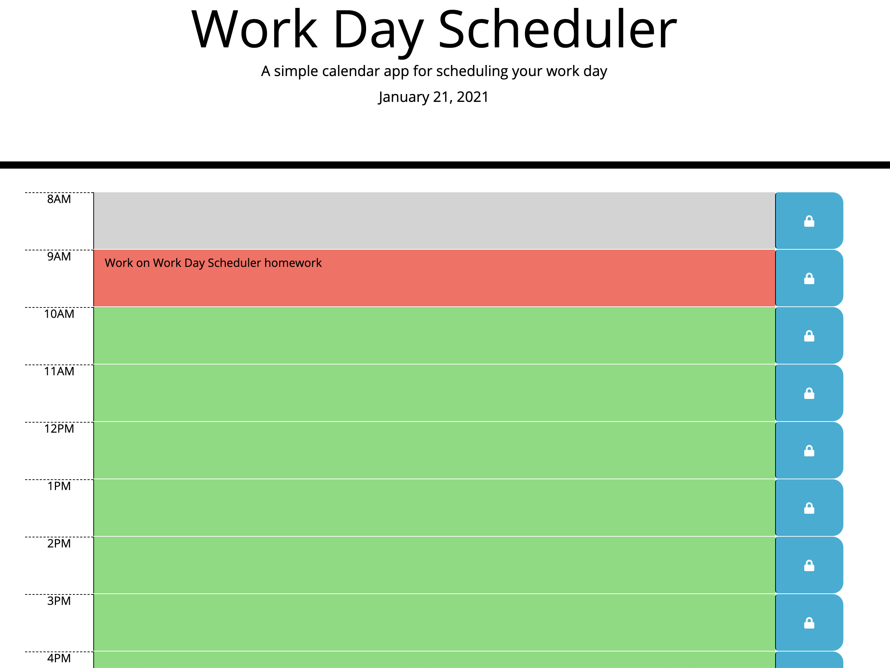

# Work Day Scheduler

Organize your day with the Work Day Scheduler. The current date is always posted on the page. The schedule is color coded to help keep your day running smoothly. All past hours are colored gray, current hour is in red, and future hours are in green. Don't forget to save your entries!

## How-to:

You can begin by clicking in the text area next to the desired hour. Type in anything you need to complete or remember for your work day. Click the lock button next to the text area to save your entry.

### Resources

[jQuery](https://jquery.com/)

### Screenshot

## Links:

* [LinkedIn](https://www.linkedin.com/in/cdfox/)
* [GitHub-Repositories](https://github.com/CFox2019/Work-Day-Scheduler)
* [GitHub-live-link](https://cfox2019.github.io/Work-Day-Scheduler/)